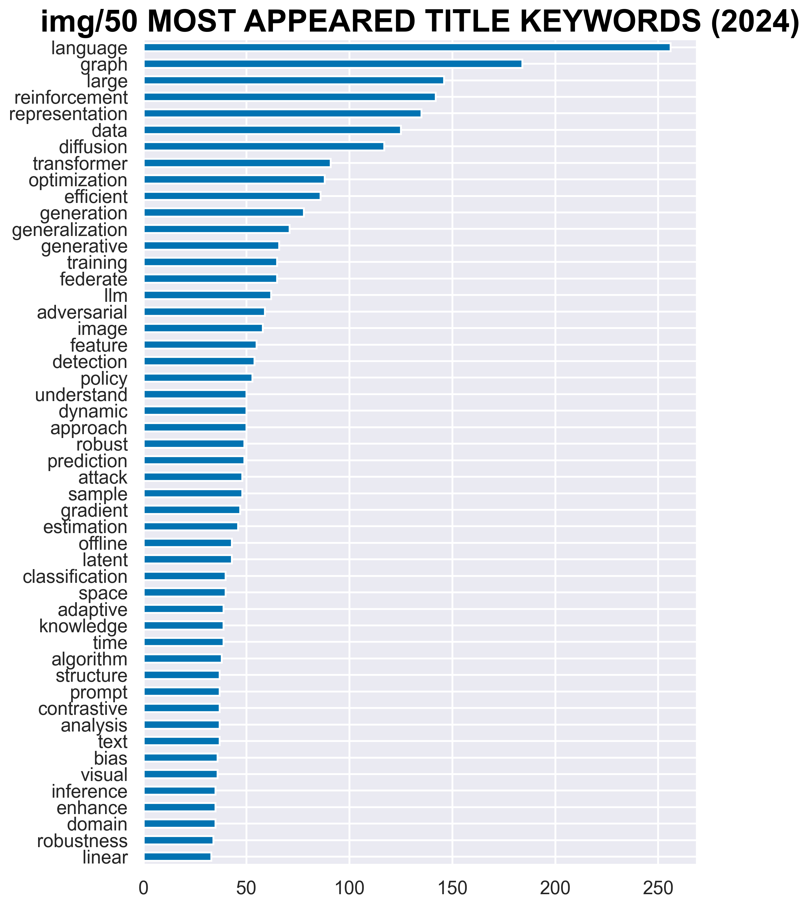

> Author: Jianghao Zhang
> Unique Name: jianghz
> Project Name: Analysis of ICLR 2024 OpenReview Data
> Github Link: https://github.com/jianghao-zhang/SI-507-Final-Project

### Project Code
Please click [here](https://github.com/jianghao-zhang/SI-507-Final-Project).

### Data Sources
The primary source of data will be the [ICLR 2024 OpenReview website](https://openreview.net/group?id=ICLR.cc/2024/Conference).

I crawled detailed information about **2402** submitted ICLR'24 papers in the OpenReview website. I used 'crawl_paperlist.py' and 'crawl_reviews.py' to extract data on **paper IDs**, **titles**, **keywords**, **abstracts**, and **ratings**. Please note that the website layout changes annually (2024!=2023!=2022), so the code may not be effective in the future.

- Estimated running time of crawl_paperlist.py: 25 mins
- Estimated running time of crawl_reviews.py: 30 mins

(Cache) The raw extracted data is stored in 'paperlist_2024.tsv' and 'ratings.tsv'. Feel free to use them.

This data will help in identifying emerging topics, the overall direction of the field, and notable shifts in research focus.

### Data Structure
For this project, I use graph structure to represent the relationships between different research papers. I.e.:
- Each node represents a paper with a unique paper ID, title, optional abstract, a list of keywords, and a mean rating stat from the OpenReview.
- Each edge represents a relationship between two papers. That is, if two papers share a keyword, they are connected by an edge. The weight of the edge is the number of shared keywords.
- Find the connected components in the graph. Each connected component represents a mixed research topic.

The code is given in 'build_keyword_graph.ipynb'. You can also see it below:
```python
class PaperNode:
    """PaperNode class for storing paper information
    """
    def __init__(self, paper_id, title, link, keyword_ls, rating=0, abstract=None):
        """__init__ function for PaperNode

        Args:
            paper_id (str): unique id for each paper
            title (str): title of the paper
            link (str): link to the paper
            keyword_ls (list of str): list of keywords
            abstract (str, optional): abstract of the paper. Defaults to None.
        """
        self.paper_id = paper_id
        self.title = title
        self.link = link
        self.keyword_ls = keyword_ls
        self.rating = rating # optional
        self.abstract = abstract # optional
        self.connectedTo = {}
        self.connected_components = []

    def __str__(self):
        return self.title

    def addNeighbor(self, neighbor_id, weight=0):
        """add neighbor to the paper

        Args:
            neighbor_id (str): neighbor id
            weight (int, optional): weight of the edge. Defaults to 0.
        """
        self.connectedTo[neighbor_id] = weight

    def calWeight(self, another_paper_node):
        """calculate the weight between two papers

        Args:
            another_paper_node (PaperNode): another paper node

        Returns:
            weight (int): weight between two papers
        """
        weight = 0
        for keyword in another_paper_node.keyword_ls:
            if keyword in self.keyword_ls:
                weight += 1
        return weight

class PaperGraph:
    """PaperGraph class for storing papers and their connections
    """
    def __init__(self):
        self.paperDict = {}
        self.numPapers = 0

    def addPaper(self, paper_id, paper: PaperNode):
        """add paper to the graph

        Args:
            paper_id (str): paper id
            paper (PaperNode): paper node
        """
        self.numPapers += 1
        self.paperDict[paper_id] = paper

    def addPaperDict(self, paper_dict: dict):
        """add paper dictionary to the graph

        Args:
            paper_dict (dict): paper dictionary
        """
        self.paperDict = paper_dict

    def getPaper(self, paper_id):
        """get paper by paper id

        Args:
            paper_id (str): paper id

        Returns:
            PaperNode: paper node
        """
        if paper_id in self.paperDict:
            return self.paperDict[paper_id]
        else:
            return None

    def addEdge(self, paper1: PaperNode, paper2: PaperNode, weight=0, threshold=1):
        """add edge between two papers

        Args:
            paper1 (PaperNode): paper node 1
            paper2 (PaperNode): paper node 2
            weight (int, optional): weight of the edge. Defaults to 0.
            threshold (int, optional): threshold of the weight, edge with weight below it will be ignored. Defaults to 1.
        """
        if weight >= threshold and paper1.paper_id != paper2.paper_id:
            self.paperDict[paper1.paper_id].addNeighbor(self.paperDict[paper2.paper_id].paper_id, weight)
            self.paperDict[paper2.paper_id].addNeighbor(self.paperDict[paper1.paper_id].paper_id, weight)

    def getPaperDict(self):
        """get the paper dictionary"""
        return self.paperDict

    def getConnection(self):
        """get the connection of the graph"""
        for paper_id in self.paperDict:
            # also include the weights
            print(self.paperDict[paper_id].paper_id, self.paperDict[paper_id].connectedTo)

    def dfs(self, paper_id, visited):
        """dfs function for finding connected components

        Args:
            paper_id (str): paper id
            visited (set): set of visited paper ids
        """
        visited.add(paper_id)
        for neighbor in self.paperDict[paper_id].connectedTo:
            if neighbor not in visited:
                self.dfs(neighbor, visited)

    def findConnectedComponents(self):
        """find connected components in the graph

        Returns:
            connected_components (list of set): list of connected components
        """
        visited = set()
        connected_components = []

        for paper_id in self.paperDict:
            if paper_id not in visited:
                component = set()
                self.dfs(paper_id, component)
                connected_components.append(component)

        return connected_components
```

Besides the graph structure, I also use a pandas data frame to store the all the paper information to present some visualization results.


### Interaction and Presentation Options
I build a command line interface (CLI) to interact with the data. The CLI is given in 'Interaction.py'.
people can choose from:
- 1. See "50 MOST APPEARED TITLE KEYWORDS (2024)"
- 2. See "Title Word Cloud for ICLR (2024)"
- 3. See "50 MOST APPEARED KEYWORDS (2024)"
- 4. See "Keyword Word Cloud for ICLR (2024)"
- 5. See "stats of 1 degree connected components of ICLR (2024) submissions with rating >= 6"
- 6. See "stats of 2 degree connected components of ICLR (2024) submissions with rating >= 6"
- 7. See "the greatest 2 degree connected component of ICLR (2024) submissions with rating >= 6"
- 8. Back to the main menu
- 9. Exit

Example output:



More advanced data analysis can be done by slightly modifying the code in 'visualization.ipynb' and 'build_keyword_graph.ipynb'.


### Demo Video Link
Click [here](https://drive.google.com/file/d/146PcLbGE2-SxCp_GcYamz8h-nyQT3DJn/view?usp=sharing) to see the demo vedio.

Thanks for reading!